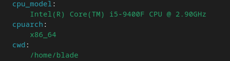

Käyttäen seuraavaa komentoa pääsin kurkkaamaan tietoja tietokoneesta mitä Salt sai kerättyä.   

```$ sudo salt-call --local grains.items```  



Silmääni iski nämä kolme asiaa: prosessorin malli, tän hetkinen työkansiö ja prosessorin arkkitehtuuri.
