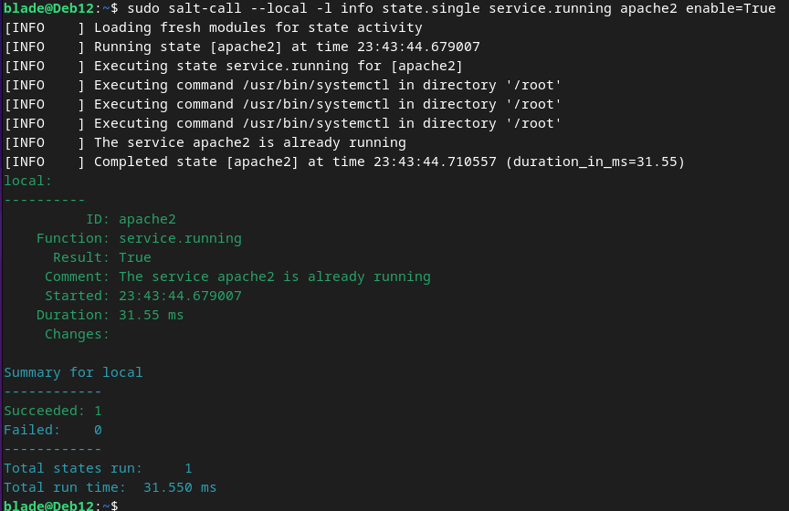
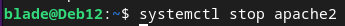
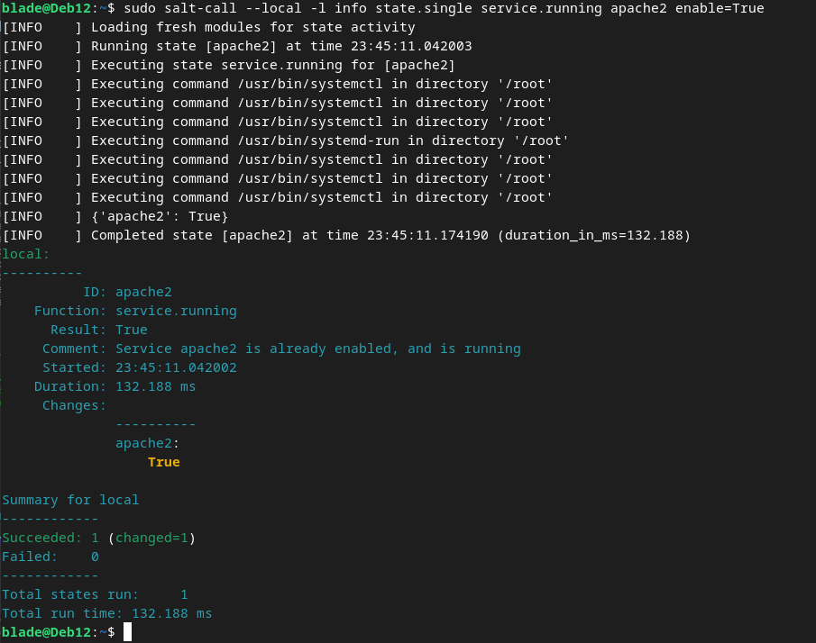
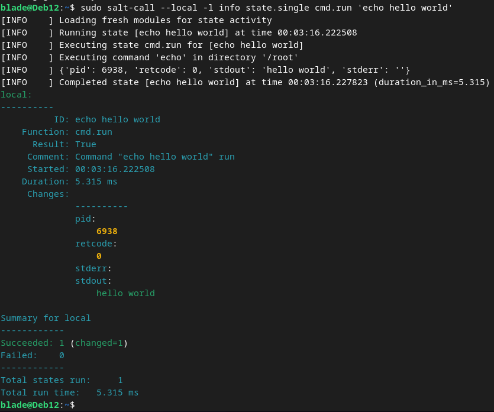

# Viisi Tärkeintä 

Tehtävässä käytetään .

## pkg.installed

  

Tässä annetaan käsky Micro tekstieditorin lataamiseen.  
Voimme toki tehdä myös vastakkaisen käskyn ja poistaa Micro koneelta komennolla:  
(Näytän tämän tässä tehtävässä kerran koska sinällään efekti on täysin sama mutta, vastakkainen)

```sudo salt-call --local -l info state.single pkg.removed micro``` 

  

Huomaamme että tässä Saltti on poistanut Micron koneeltamme juuri niinkuin sitä on käsketty.

## file.managed/absent

  

Tässä huomataan että luodaan tekstitiedosto jos se ei ole olemassa meidän määräämässä kansiossa. Vastaavasti file.absent poistaa tiedoston.

## service.running/dead

  

Näemme että Apache2-palvelin on toiminnassa ja kokeillaan sammuttaa se käsin.  

  

Huomaamme että se on alhaalla ja käsketään Saltti käynnistää se uudelleen.  

  

## user.present/absent

Luodaan käyttäjä nimeltä tero ja annetaan sille kenkää.  


## cmd.run

  

Olkoon, antaa koneen echottaa Hello Worldia. Tätä voi toistaa ikuisesti ja aina on changed = 1, kyseessä ei ole idempotenssi tila. (Viisikko, JussiMol)

# Lähteet
Infra as Code 2023, Tero Karvinen
https://terokarvinen.com/2023/configuration-management-2023-autumn/

Run Salt Command Locally, Tero Karvinen
https://terokarvinen.com/2021/salt-run-command-locally/

Viisikko H1, JussiMol
https://github.com/JussiMol/Palvelinten-hallinta/blob/main/h1/Viisikko.md
