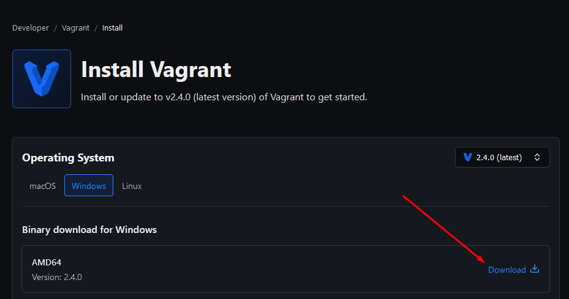
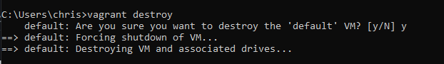
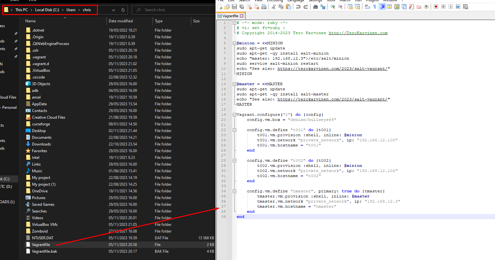
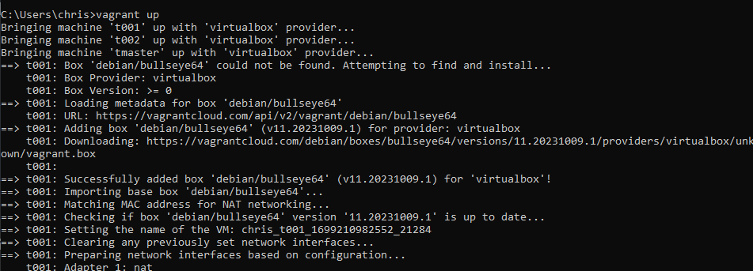

# X) Tiivistä  

## Cattle or pet?  

- Pet aka lemmikki, käsin rakennettu, "käsin ruokittu" ja ylläpidettävä järjestelmä/serveri(-pari) jossa on paljon "tunnearvoa"
- Cattle aka karja, ovat serverit jotka rakkennetaan automaatio-työkailuilla sekä ovat suunniteltuja kaatumaan. Niille ei ole lainkaan tunne arvoa koska
  muutaman serverin kaatuminen ja uudelleen asennus automaatiotyökaluja eivät vaadi ihmiseltä toimenpiteitä.
  
(What is the definition of "cattle not pets"?, )  

## Vargant  


# A) Asenna Vagrant  



Siirrytään Vagrantin omalle nettisivulle ja ladataan sieltä Vagrant Windowsille. Valitaan oikea versio ja asennetaan koneelle sekä käynnistetään kone uudestaan asennuksen suoritettua.  

Avataan Windowsin komentorivi ja tarkistetaan onko Vagrant asennettu koneelle. Seurataan Vagrantin dokumentaation mukaisia . (Install Vagrant, HashiCorp)  

  

  

Vagrant näyttää toimivan tietokoneella.

# B) Yksi maankiertäjä  

Seurataan opettajan antamia  Vagrantin virtuaalikoneiden asennukseen. (Vagrant Revisited – Install & Boot New Virtual Machine in 31 seconds, Tero Karvinen)  

Luodaan siis Ubuntu 16.04 VM.  

  

Seuraavaksi laukauistaan kone käyntiin.  

  

Otetaan siihen SSH-yhteys.  

  

# C) Oma orjansa  

Siirryttän opettajan [sivulle](https://terokarvinen.com/2023/salt-vagrant/) josta löytyy Vagrantfile-tiedostolle halutut määritelmät. (Salt Vagrant - automatically provision one master and two slaves, Tero Karvinen)  

 on funktio jolla määritellään kuinka monta ja millaisia virtuaalikoneita Vagrantilla luodaan projketia varten. (Vagrantfile, HashiCorp)  

Ensin poistetaan vanha Vagrantilla luotu virtuaalikone.  
  

Tarvitsemme siis opettajan halutut konfiguraatiot virtuaalikoneisiin Vagrantilla joten, siirrymme Vagrantfile-tiedoston sijaintiin. Vagrantfile sijaitsee käyttäjämme kotihakemistossa jopa Windowsissa. Kopioidaan opettajan konfiguraatiot tiedostoon.  
  

Ajetaan Vagrant uudestaan. Täällä kertaa vain ```vagrant up``` komennolla.  
  


# D) Asenna Saltin herra-orja arkkitehtuuri toimimaan verkon yli  


# E) Aja useita idempotentteja komentoja verkon yli  


# F) Kerää teknistä tietoa orjista verkon yli  


# G) Aja shell-komento orjalla verkon yli  


# H) Hello, IaC  


# Lähteet:

Infra as Code 2023, Tero Karvinen  
https://terokarvinen.com/2023/configuration-management-2023-autumn/#h2-karjaa  

What is the definition of "cattle not pets"?, Richard Slater  
https://devops.stackexchange.com/questions/653/what-is-the-definition-of-cattle-not-pets#654  

Install Vagrant, HashiCorp  
https://developer.hashicorp.com/vagrant/docs/installation  

Vagrant Revisited – Install & Boot New Virtual Machine in 31 seconds, Tero Karvinen  
https://terokarvinen.com/2017/04/11/vagrant-revisited-install-boot-new-virtual-machine-in-31-seconds/  

Salt Vagrant - automatically provision one master and two slaves, Tero Karvinen  
https://terokarvinen.com/2023/salt-vagrant/  

Vagrantfile, HashiCorp  
https://developer.hashicorp.com/vagrant/docs/vagrantfile  
